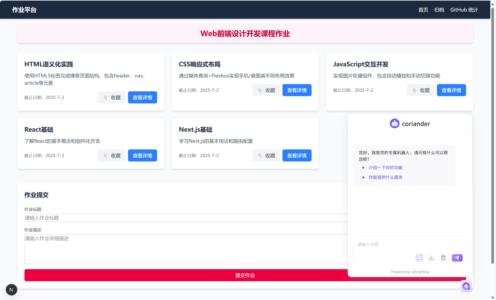
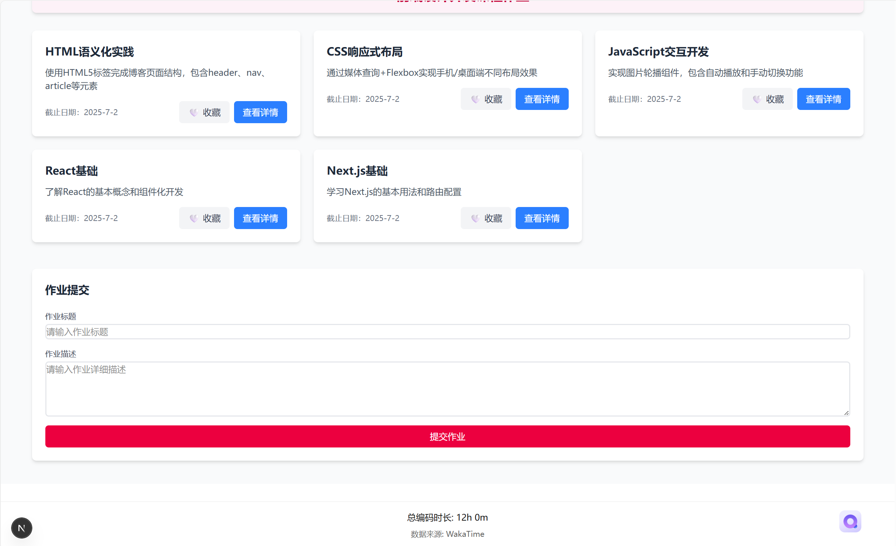
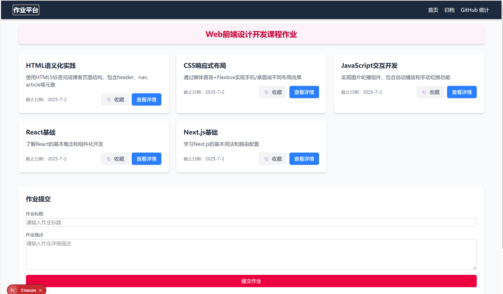
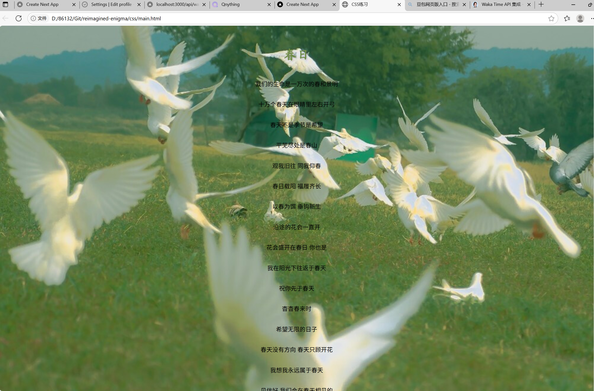

This is a [Next.js](https://nextjs.org) project bootstrapped with [`create-next-app`](https://github.com/vercel/next.js/tree/canary/packages/create-next-app).

## Getting Started

First, run the development server:

```bash
npm run dev
# or
yarn dev
# or
pnpm dev
# or
bun dev
```

Open [http://localhost:3000](http://localhost:3000) with your browser to see the result.

You can start editing the page by modifying `app/page.js`. The page auto-updates as you edit the file.

This project uses [`next/font`](https://nextjs.org/docs/app/building-your-application/optimizing/fonts) to automatically optimize and load [Geist](https://vercel.com/font), a new font family for Vercel.

## Learn More

To learn more about Next.js, take a look at the following resources:

- [Next.js Documentation](https://nextjs.org/docs) - learn about Next.js features and API.
- [Learn Next.js](https://nextjs.org/learn) - an interactive Next.js tutorial.

You can check out [the Next.js GitHub repository](https://github.com/vercel/next.js) - your feedback and contributions are welcome!

## Deploy on Vercel

The easiest way to deploy your Next.js app is to use the [Vercel Platform](https://vercel.com/new?utm_medium=default-template&filter=next.js&utm_source=create-next-app&utm_campaign=create-next-app-readme) from the creators of Next.js.

Check out our [Next.js deployment documentation](https://nextjs.org/docs/app/building-your-application/deploying) for more details.

项目简介：

本项目是一个基于 Next.js 开发的个人博客应用，主要用于展示个人的技术博客和项目。它集成了一些常用的技术栈，如 Next.js、React、Tailwind CSS 等。

项目功能：

展示个人博客：在首页展示个人的博客文章，包括标题、摘要、发布日期等。
文章分类和标签：根据文章的分类和标签进行组织，方便用户查找和筛选。
收藏功能：用户可以在文章详情页进行收藏。
响应式设计：项目采用移动端优先的设计理念，确保在不同设备上的良好显示效果。
作业提交：可以自行提交作业

技术栈：

Next.js：一个基于 React 的前端框架，用于构建高性能的 Web 应用。
React：一个用于构建用户界面的 JavaScript 库。
Tailwind CSS：一个实用的 CSS 框架，用于快速构建自定义的用户界面。

QAnything集成路径与实现细节：
路径1：
在项目中，我们使用了 QAnything 组件来实现问答功能。QAnything 是一个基于 React 的问答组件，它可以在页面中嵌入一个问答模块，用户可以在其中输入问题并获取答案。
原因：
QAnything 组件提供了一个简单易用的问答功能，与项目的主题相符，用户可以方便地获取到相关的技术问题的答案。技术实现相对简单。
  

Waka Time API集成方法：
1. 获取 API 密钥
登录 WakaTime 账号，访问 API 密钥页面
复制 api_key（格式类似 waka_XXXXXXXX-XXXX-XXXX-XXXX-XXXXXXXXXXXX）
2. 验证 API 访问
使用 cURL 或 Postman 测试 API 连接：
curl -X GET "https://wakatime.com/api/v1/users/current" \
-H "Authorization: Basic $(echo -n "YOUR_API_KEY:" | base64)"


Next.js项目结构：
- components/：存放可复用的组件，如 QAnything 组件。
- pages/：存放页面组件，如首页、文章详情页等。
- styles/：存放全局样式文件。
- public/：存放静态资源，如图片等。



旧作业整合方式以及项目运行指南：
1. 旧作业整合：
将旧作业的代码文件（如 HTML、CSS、JavaScript）复制到项目的适当位置（如 pages 目录）。
确保旧作业的页面能够正确访问，并且与新的 Next.js 项目的路由结构相匹配。
2. 项目运行：
确保已经安装了 Node.js 和 npm（或 yarn）。
